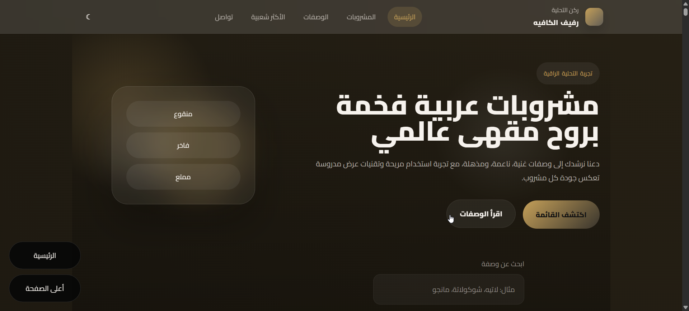
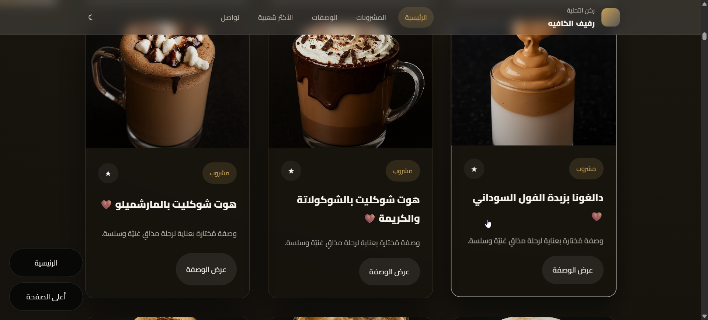
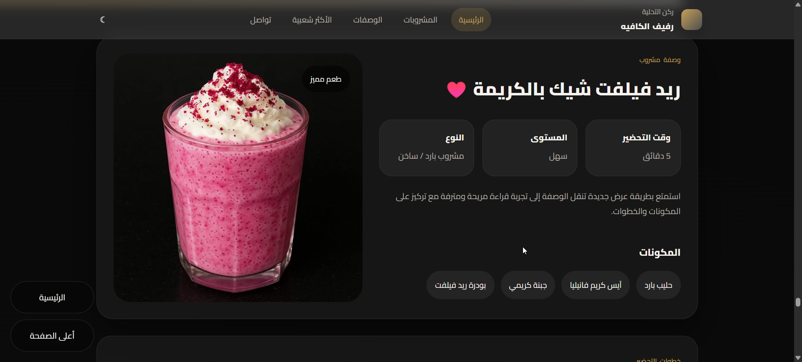

<div align="center">

# ☕ RKN AL TAHLIA

### Premium Arabic Beverage Recipes Platform

A modern, elegant, and fully responsive React.js application that provides a premium experience for exploring and preparing Arabic beverages through an intuitive interface, smooth animations, and a carefully crafted user experience.

<p align="center">
  
  
  
  
  
</p>

</div>

---

# 📖 Overview

**RKN AL TAHLIA** is a modern beverage recipe platform built with **React.js** that delivers a premium browsing experience inspired by luxury cafés and modern restaurant websites.

The application allows users to discover beverages, search recipes instantly, browse categories, and read detailed preparation instructions through an elegant and responsive interface.

The project emphasizes clean architecture, modern UI/UX principles, smooth animations, accessibility, and responsive layouts.

---

# ✨ Features

- 🎨 Premium Modern UI/UX
- 🌙 Dark & Light Theme
- 🔍 Instant Recipe Search
- 🥤 Category Filtering
- 📱 Fully Responsive Design
- ⚡ Smooth Animations (Framer Motion)
- 📖 Detailed Recipe Pages
- 🧭 Smooth Navigation
- 📌 Floating Action Buttons
- 📊 Scroll Progress Indicator
- ❤️ Interactive Recipe Cards
- 📬 Contact Section
- ⚙️ Clean Component-Based Architecture
- 🚀 Optimized Performance

---

# 📸 Screenshots

## Hero Section



---

## Drinks Collection



---

## Recipe Details



---

# 🏗️ Project Structure

```text
recipes-tk
│
├── assets
│   └── screenshots
│       ├── hero-section.png
│       ├── drinks-grid.png
│       └── recipe-details.png
│
├── public
│
├── src
│   ├── components
│   │   ├── Contact.js
│   │   ├── FloatingActions.js
│   │   ├── Footer.js
│   │   ├── HeroSection.js
│   │   ├── Navbar.js
│   │   ├── RecipeCardGrid.js
│   │   ├── RecipeDetails.js
│   │   └── Toast.js
│   │
│   ├── hooks
│   │   └── useScrollProgress.js
│   │
│   ├── App.js
│   ├── App.css
│   ├── data.js
│   ├── index.js
│   └── index.css
│
├── package.json
└── README.md
```

---

# 🛠️ Technologies Used

| Technology | Purpose |
|------------|---------|
| React.js | Frontend Framework |
| JavaScript (ES6+) | Application Logic |
| CSS3 | Styling |
| Framer Motion | Animations |
| HTML5 | Markup |

---

# 🚀 Getting Started

## Clone the repository

```bash
git clone https://github.com/eslam-adel25/recipes-tk.git
```

## Navigate to the project

```bash
cd recipes-tk
```

## Install dependencies

```bash
npm install
```

## Start the development server

```bash
npm start
```

The application will be available at:

```
http://localhost:3000
```

---

# 🎨 Design Highlights

The interface was designed following modern UI/UX principles:

- Premium visual identity
- Elegant typography
- Glassmorphism effects
- Smooth micro-interactions
- Balanced spacing
- Luxury color palette
- Responsive layouts
- Modern navigation
- Interactive cards
- Accessible interface

---

# ⚡ Performance

The application includes several optimizations:

- Component-based architecture
- Reusable UI components
- Lazy rendering where appropriate
- Responsive layouts
- Smooth animations
- Clean project structure
- Optimized React rendering

---

# 📱 Responsive Design

Optimized for:

- Desktop
- Laptop
- Tablet
- Mobile Devices

---

# 📌 Future Enhancements

- User Authentication
- Favorite Recipes
- Backend Integration
- Recipe Ratings
- Admin Dashboard
- Multi-language Support
- Cloud Database
- API Integration

---

# 👨‍💻 Author

## Eslam Adel

Computer Science Student

Frontend Developer

React Developer

---

# 📬 Contact

**Email**

Eslam.Adel2596@gmail.com

**LinkedIn**

https://www.linkedin.com/in/eslam-adel-jadalrab-808862361

**Facebook**

https://www.facebook.com/eslam20057

**GitHub**

https://github.com/eslam-adel25

**Vercel**

https://tahlia-lemon.vercel.app

---

# ⭐ Support

If you found this project useful, please consider giving it a ⭐ on GitHub.

Your support helps motivate future improvements and new open-source projects.

---

<div align="center">

### Made with ❤️ by Eslam Adel

</div>